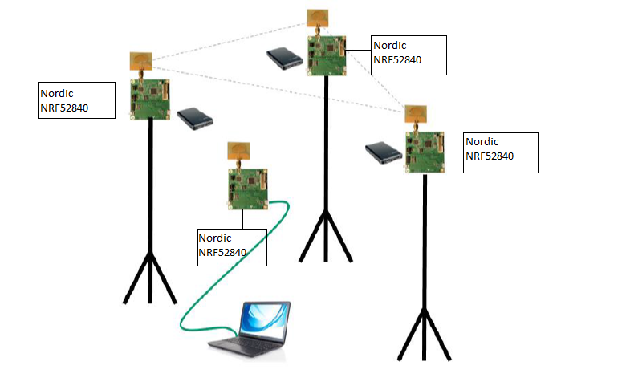
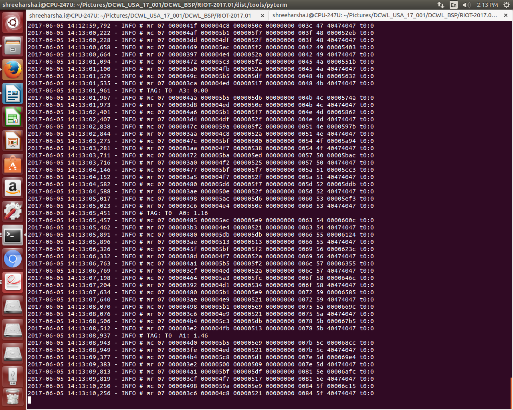

## Navigation Use-case
* For evaluating the Navigation use case the system is configured as:
   * 3 Anchors
   * 1 Tag
  
* Flash the four NRF52840 Nordic platforms with `dw1000_rtls_arm` application as mentioned in README.md. 
* For `dw1000_rtls_arm` example, the configuration of the Anchor/Tag will be done using user input terminal as shown below.
    * To configure the device as Anchor 0 with Mode 0 :
        ```bash
        Select Mode Configuration:  0:Mode-0 1:Mode-1 2:Mode-2 3:Mode-3
        0
        Select UNIT: 0:TAG 1:ANCHOR
        1
        Enter UNIT ID: 0 t0 2
        0
        ```
    * To configure the device as Anchor 1 with Mode 0: 
      ```bash
      Select Mode Configuration:  0:Mode-0 1:Mode-1 2:Mode-2 3:Mode-3
      0
      Select UNIT: 0:TAG 1:ANCHOR
      1
      Enter UNIT ID: 0 t0 2
      1
      ```
    * To configure the device as Anchor 0 with Mode 0 : 
      ```bash
      Select Mode Configuration:  0:Mode-0 1:Mode-1 2:Mode-2 3:Mode-3
      0
      Select UNIT: 0:TAG 1:ANCHOR
      $ 1
      Enter UNIT ID: 0 t0 2
      $ 2
      ```
* The Tag are configured using user-interface provide in `dw1000_rtls_arm` example as shown below.
    * To configure the device as Tag 0 with Mode 0 : 
       ```bash
       Select Mode Configuration:  0:Mode-0 1:Mode-1 2:Mode-2 3:Mode-3
       0
       Select UNIT: 0:TAG 1:ANCHOR
       0
       Enter UNIT ID: 0 t0 2
       0
       ```
## Arrangement
* Mount the 3 Anchors at the same height
  Note: Differences in heights will result in reduced accuracy of location
* Mount the 3 Anchors high enough where there is good Line-of-Sight (LOS) with no
obstructions between them e.g. mounting 2-3 m high would ensure they are above
people’s heads which will help avoid interference.
* Mount the 3 Anchors to create a triangle
* Ensure the antennas are >15 cm away from the nearest wall or any other objects
* Connect the PC to the Tag 
open a new terminal and input
 - “cd riot-dw1000/RIOT/dist/tools/pyterm”
 - “sudo ./pyterm -p /dev/ttyACM0”
* Power the other 2 Anchors and the Tag using an external USB battery (or other
method)

## Log From A0

