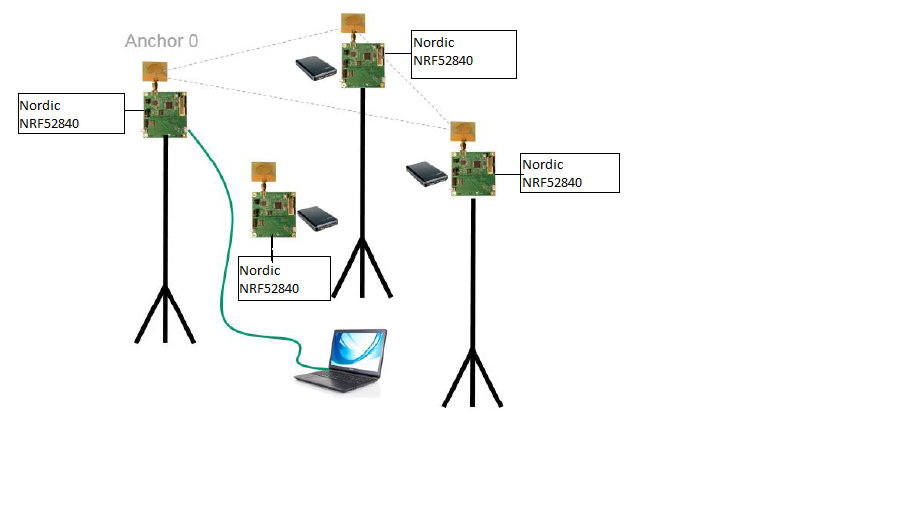

* For evaluating the tracking use case the system is configured as:
   * 3 Anchors
   * 1 Tag
  
* Flash the four NRF52840 Nordic platforms with `dw1000_rtls_arm` application as mention in README.md. 
* The Anchors are configured using user-interface provide in `dw1000_rtls_arm` example as shown below.
    * For A0 :
        ```bash
        Select Mode Configuration:  0:Mode-0 1:Mode-1 2:Mode-2 3:Mode-3
        0
        Select UNIT: 0:TAG 1:ANCHOR
        1
        Enter UNIT ID: 0 t0 2
        0
        ```
    * For A1 : 
     ```bash
      Select Mode Configuration:  0:Mode-0 1:Mode-1 2:Mode-2 3:Mode-3
      0
      Select UNIT: 0:TAG 1:ANCHOR
      1
      Enter UNIT ID: 0 t0 2
      1
      ```
    * For A2 : 
     ```bash
      Select Mode Configuration:  0:Mode-0 1:Mode-1 2:Mode-2 3:Mode-3
      0
      Select UNIT: 0:TAG 1:ANCHOR
      1
      Enter UNIT ID: 0 t0 2
      2
      ```
* The Tag are configured using user-interface provide in `dw1000_rtls_arm` example as shown below.
    * For T0 : 
     ```bash
      Select Mode Configuration:  0:Mode-0 1:Mode-1 2:Mode-2 3:Mode-3
      0
      Select UNIT: 0:TAG 1:ANCHOR
      0
      Enter UNIT ID: 0 t0 2
      0
     ```
## Arrangement
* Mount the 3 Anchors at the same height
  Note: Differences in heights will result in reduced accuracy of location
* Mount the 3 Anchors high enough where there is good Line-of-Sight (LOS) with no
obstructions between them e.g. mounting 2-3 m high would ensure they are above
people’s heads which will help avoid interference.
* Mount the 3 Anchors to create a triangle
* Ensure the antennas are >15 cm away from the nearest wall or any other objects
* Connect the PC to with Anchor0 and open pytrem for log.
* Power the other 2 Anchors and the Tag using an external USB battery (or other
method)


## Log From A0
